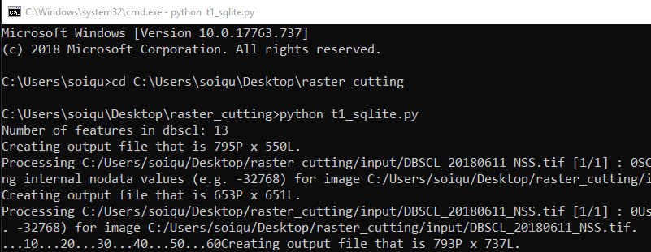
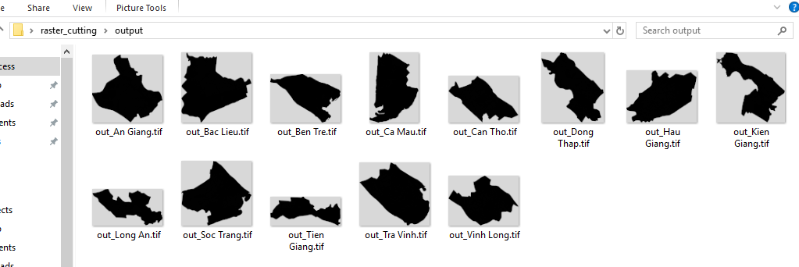
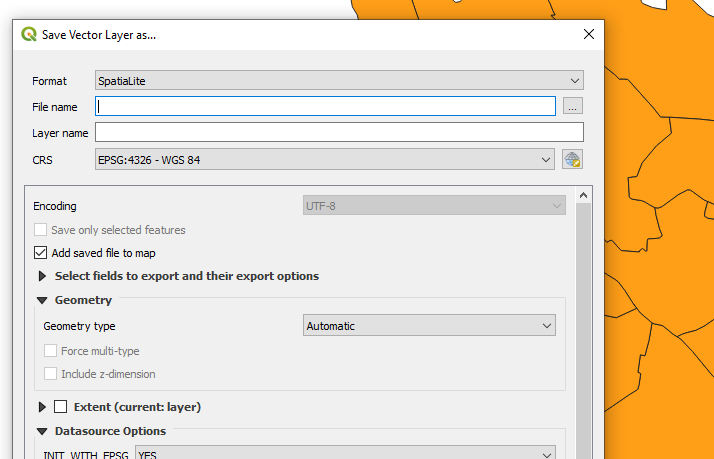

# raster_cutting
Cut raster for each features in a vector layer

## Require
* Python with `GDAL` installed
* Path to `bin folder` of QGIS. Ex `C:/Program Files/QGIS 2.18/bin/gdalwarp`

> You can install python GDAL by wheel package I downloaded
* For Python 3.6 - 64 bit `GDAL-2.4.1-cp36-cp36m-win_amd64.whl`
* For Python 3.6 - 32 bit `GDAL-2.4.1-cp36-cp36m-win32.whl`

> Install wheel
`pip install GDAL-2.4.1-cp36-cp36m-win32.whl`

## SQlite version (Easier to config)
> t1_sqlite.py

### Config

```python
fbin='C:/Program Files/QGIS 2.18/bin/gdalwarp'
rasterFile='C:/Users/soiqu/Desktop/raster_cutting/input/DBSCL_20180611_NSS.tif'
fout='C:/Users/soiqu/Desktop/raster_cutting/output/'
dbName='dbscl.sqlite'
#Vector table (layer) name
tblName='dbscl'
#Column name which used as condition to define each feature (ex. each province in dbscl layer)
dkCol='ten_eng'
```

### Run script

* Download and `cd` to this folder
* Copy your raster file and sqlite vector layer to this folder
* Config file `t1_sqlite.py` depending on your project
* Run `python t1_sqlite.py`




## PostgreSQL version

> t1_pgsql.py

### Config

```python
fbin='C:/Program Files/QGIS 2.18/bin/gdalwarp'
rasterFile='C:/Users/soiqu/Desktop/raster_cutting/input/DBSCL_20180611_NSS.tif'
fout='C:/Users/soiqu/Desktop/raster_cutting/output/'
databaseServer = "localhost"
databaseName = "raster_cutting"
databaseUser = "postgres"
#Your password to login PostgreSQL
databasePW = "******"
#Your PostgreSQL port (defaul is 5432)
databasePort = "5433"
connString = "PG: host=%s dbname=%s user=%s password=%s port=%s" % (databaseServer,databaseName,databaseUser,databasePW,databasePort)
#Vector table (layer) name
tblName='dbscl'
#Column name which used as condition to define each feature (ex. each province in dbscl layer)
dkCol='ten_eng'
```

### Run script

* Download and `cd` to this folder
* Copy your raster file and sqlite vector layer to this folder
* Config file `t1_pgsql.py` depending on your project
* Run `python t1_pgsql.py`

## How to get SQLite file

You can export it from Shapefile by `QGIS`



## Todo
* Loop all rasters in a folder to cut

## Preferences

> gdalwarp
`"C:/Program Files/QGIS 2.18/bin/gdalwarp" -cutline dbscl.sqlite -csql "select * from dbscl where ten_eng='Tra Vinh'" -crop_to_cutline -of GTiff -dstnodata -9999.0 -overwrite "DBSCL_20180611_NSS.tif" "C:/Users/soiqu/Desktop/raster_cutting/output/out_Tra Vinh.tif"`

> Subprocess
http://queirozf.com/entries/python-3-subprocess-examples

